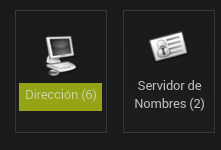

Para hacer esta actividad necesitas dos maquinas de Ubuntu Server una en la que habeis creado la zona primaria y los registros 
y otra nueva donde irá el servidor secundario.

En la configuración de red del servidor primario añadimos en el DNS predefinido la IP del servidor secundario. Luego, en la configuración del servidor secundario o esclavo hacemos la misma configuración vista anteriormente pero poniendole una IP distinta y en servior DNS ponemos la IP del primario y la del secundario.

Además para configurar el servidor secundario o esclavo primero debemos hacer unos cambios en el servidor primario.

1. Entramos en la zona maestra o principal de busqueda directa en nuestro servidor principal y enramos a "servidor de nombres" una vez ahí ponemos lo siguente:

2.Luego entramos en "direcciones" y ponemos el nombre del servidor secundario y su IP, después, le damos a crear.

3. A continuación, entramos en "editar opciones de zona" y permitimos la transferencia a nuestro servidor secundrio poniendo la IP.

4.Ahora vamos a la zona de busqueda inversa y hacemos lo siguente:

5. Después, en "dirección inversa" ponemos la IP y el nombre del servidor secundario. (Si tenéis puesto que se actualice, en las direcciones de la zona directa no será necesario ponerlo, ya que, se pondrá solo).

6. Por último, también habilitaremos la tranferencia en la zona inversa como lo hemos hecho antes desde opciones de zona.

7. Seguidamente entramos en el webmin del servidor secundario y con el bind ya instalado vamos a añadir una zona esclava de tipo directa.

8.Ahora creamos otra pero de busqueda inversa de la siguente forma.

9.Por último para comprobar que funciona correctamente
